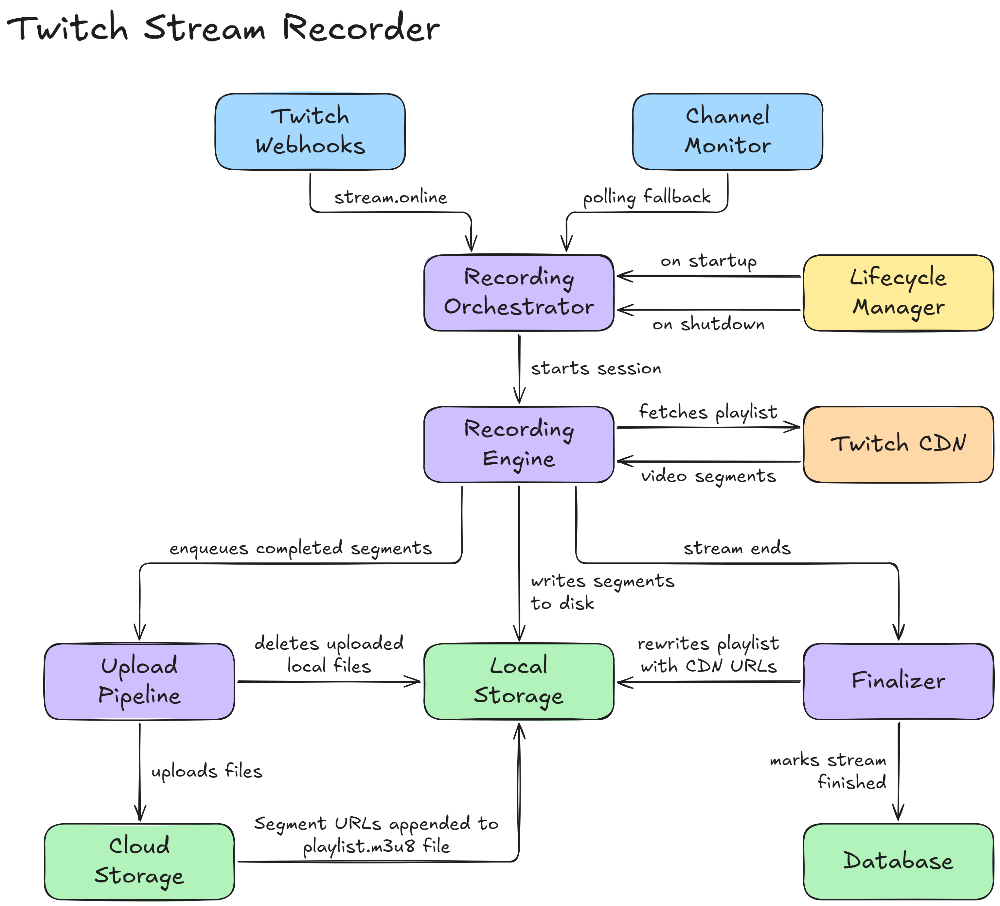
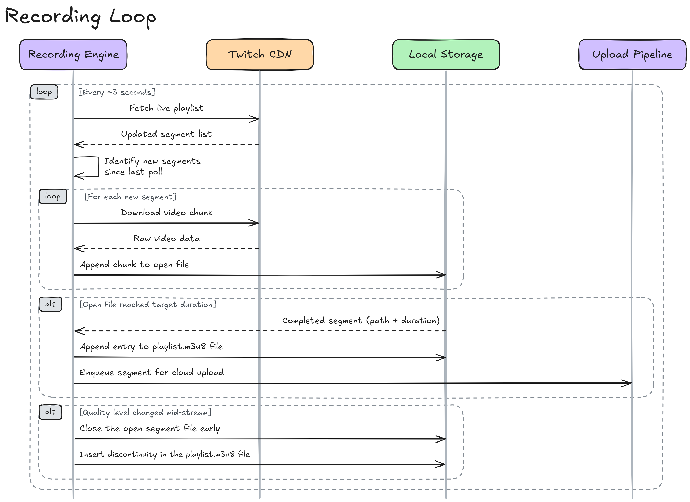
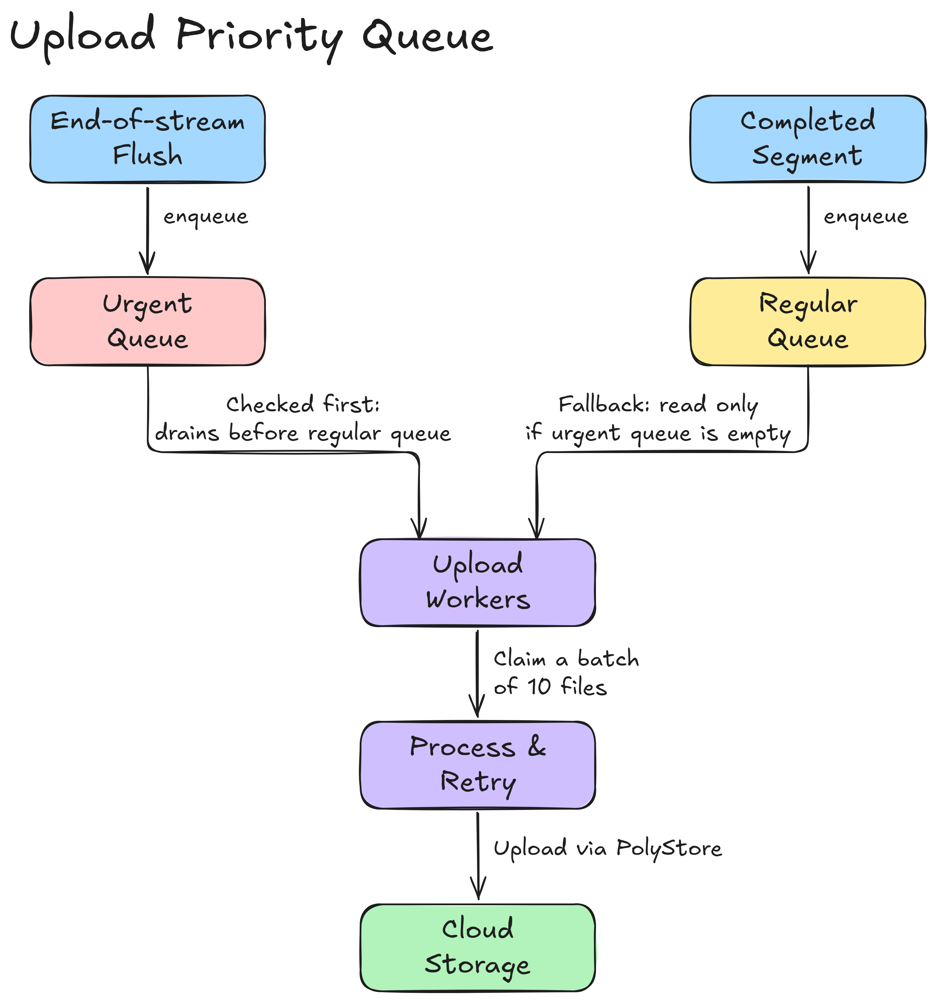
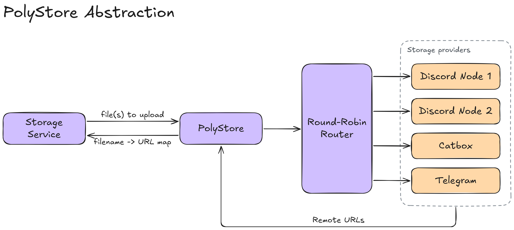
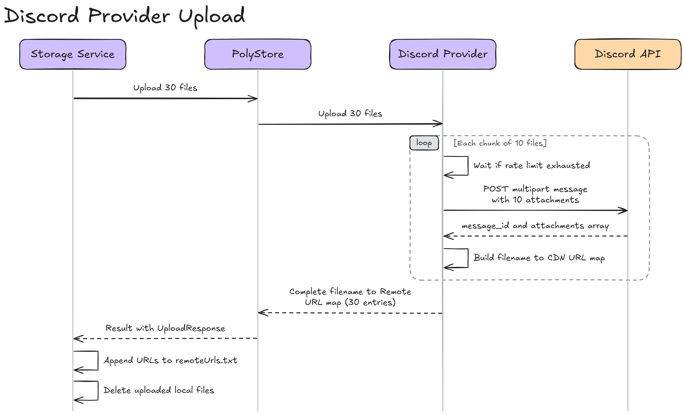
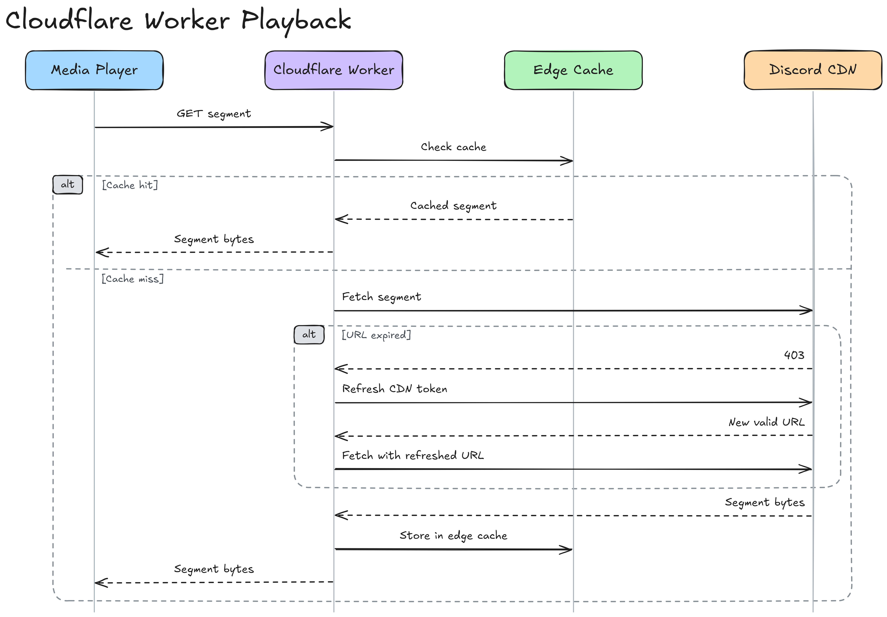

# TwitchVault

## The problem

Twitch is an ephemeral platform. Streams end and the recording either vanishes within 14 to 60 days, never existed because the streamer has VOD storage disabled, or is locked behind a subscription. If you want a reliable archive of content you care about, you are on your own.

TwitchVault runs entirely in the background. It detects when channels go live through Twitch's webhook system, starts recording when a stream begins, uploads segments to cloud storage as they are produced, and has the full archive ready when the stream ends.

## Key features

- **Automatic detection:** Twitch fires a webhook event when a monitored channel goes live, and a scheduled fallback job catches anything the webhook misses.
- **Real-time HLS recording:** the live stream playlist is tracked and each video segment is captured as it becomes available.
- **Live upload while recording:** segments are uploaded concurrently, so the archive is already in the cloud when the stream ends.
- **Multi-provider storage:** `PolyStore` routes uploads across different storage providers (Discord CDN is the main storage) through one provider-agnostic interface.
- **Cloudflare Workers:** they regenerate expiring Discord CDN URLs, cache segments at the edge for playback, and proxy uploads to spread load across concurrent bot instances.
- **Automatic VOD cleanup:** streams that are still available as public VODs on Twitch are deleted after a retention window.
- **Crash and restart recovery:** on restart, TwitchVault detects interrupted streams, checks whether they are still live on Twitch, and resumes recording where it stopped.

## Tech stack

| Layer | Technology |
|---|---|
| Runtime | .NET 8 |
| Architecture | Vertical Slice Architecture |
| Database | SQL Server via EF Core 8 (pooled `DbContextFactory`) |
| HTTP resilience | `Polly` with exponential backoff and jitter |
| Cloud storage | [PolyStore](https://github.com/IsHecker/polystore) (custom library): Discord CDN, Telegram, Catbox |
| CDN infrastructure | Cloudflare Workers: URL regeneration, edge caching, upload proxying |
| Twitch integration | `TwitchLib.EventSub.Webhooks` for webhook delivery, and custom Twitch clients |
| Background jobs | Quartz.NET hosted service |
| Auth | Google OAuth to JWT, sliding-window rate limiter on auth endpoints |
| Logging | Serilog |
| Testing | `xUnit`, `NSubstitute`, and `FluentAssertions` |

## Architecture overview

TwitchVault is a single application structured around vertical feature slices instead of horizontal layers. Most of the system is a set of long-running background pipelines that operate autonomously with a small HTTP API surface.



## Project layout

```
TwitchVault/
├── src/
│   └── TwitchVault.Api/
│       ├── Features/
│       │   ├── Auth/          # Google OAuth → JWT issuance, token validation
│       │   ├── Channels/      # Channel management, Twitch webhook subscriptions
│       │   ├── Recording/     # HLS pipeline, parsing, live upload, session lifecycle
│       │   ├── Settings/      # Runtime-configurable settings via hot-reload
│       │   ├── Storage/       # Quartz jobs: upload, cleanup, Public-VOD deletion
│       │   ├── Streams/       # Stream management, queries, HTTP endpoints
│       │   └── Twitch/        # GQL client, Helix client, EventSub handling
│       ├── Common/            # File system abstraction, resilience, result types
│       ├── Database/          # EF Core context and migrations
│       ├── Configuration/     # DI wiring and options
│       ├── Infrastructure/    # Middleware, Swagger, event bus
│       └── lib/               # PolyStore assemblies
├── test/
│   └── TwitchVault.Api.Tests.Unit/
├── workers/                   # Cloudflare Worker scripts
└── docs/                      # diagrams
```

## The HLS recording pipeline

HLS is Twitch's delivery format. A live stream is broken into short video segments, and a playlist file is updated every few seconds to list which segments are available and in what order.

### How the recording loop works



### Playlist parsing

The playlist is parsed with `System.IO.Pipelines` directly from the network buffer, with minimal allocations. See [Minimal-allocation playlist parsing](#minimal-allocation-playlist-parsing) in Challenges for the full breakdown.

### Segment accumulation

Instead of writing each Twitch segment (2 seconds long) as a separate file, the store accumulates incoming data into a single open file stream until the target duration is reached (configurable, default 10 seconds). Only then does it close the file and return it as a complete local segment for playlist writing and the upload queue. This keeps the number of files manageable.

### Writing the playlist

As each completed segment is handed off, its filename and duration are appended to a live `.m3u8` playlist file on disk. The writer keeps the file stream open for the lifetime of the recording and uses a pre-allocated byte buffer to avoid encoding overhead on every write. It flushes on a time interval instead of on every segment, which keeps things light on the OS.

When the recorder disposes, the playlist is closed by writing the header and adding the `#EXT-X-ENDLIST` marker atomically at the end.

## Live upload while recording

The moment a segment is completed, it goes to the upload pipeline to be uploaded concurrently while recording.

### The priority queue



The queue has two tiers. Regular segments enter one channel, and the remaining segments at the end of a stream are flushed to an urgent channel that workers drain first. Awaiting both channels at once would leak uncompleted waiter nodes into the channel's internal linked list, so the queue uses a single semaphore as a shared signal instead. See [Priority queue without leaking waiters](#priority-queue-without-leaking-waiters) in Challenges.

The number of upload workers is hot-reloadable and the pool scales up or down immediately without a restart.

### After upload

Once a batch uploads successfully, the local segment files are deleted. A `remoteUrls.txt` file in each stream's folder maps every uploaded filename to its Remote URL. This file serves as the local source of truth for playlist rewriting as well as remote deletion when streams expire or are deleted by background cleanup jobs.

### Playlist rewriting after upload

Once all segments are uploaded and recording concludes, the playlist is rewritten so that every local filename in the `.m3u8` file points to its remote CDN URL. Matching is by filename instead of line position, so the rewrite is idempotent: it can run multiple times safely and handles partial uploads correctly.

## PolyStore, the cloud storage library

Discord, Telegram, and Catbox aren't traditional storage services, so using them as storage means handling per-provider quirks: Discord allows at most 10 file attachments per message, Telegram has file size limits, and Catbox takes a multipart HTTP form upload. Callers shouldn't be concerned with these details directly.

PolyStore is an independent storage abstraction library that hides all of this behind a single provider-agnostic façade. Source and internals: [PolyStore repo](https://github.com/IsHecker/polystore).

### The abstraction



A caller hands `PolyStore` a list of files and gets back a mapping of filename to remote URL along with the provider's name. Which provider handled the upload, how many API calls it took, what the batch size was, and what rate limits applied all stay invisible to the caller.

### Provider discovery

Providers register themselves with a `[StorageProvider]` attribute. At startup, `PolyStore` scans the assembly, finds every implementation, and builds a registry. Provider instances are created dynamically from configuration: each configured instance becomes a live provider instance with its own credentials, concurrency limits, and behavior options, making instance addition purely a configuration concern and trivial. See the [Configuration](#configuration) section for the full `secrets.json` format.

### The router

Instance selection uses lock-free round-robin. An atomic integer is incremented on every upload request, and the result picks the instance that handles it.

### The Discord provider

Discord is the primary cloud storage because it is free and has no storage quota. It isn't built to be a file store, which made a reliable provider challenging to write:

- **Attachment limits & chunking:** Discord's API allows at most 10 file attachments per message, while a single upload call from a caller can contain any number of files. The provider chunks them into groups of 10, sends one API request per chunk, and accumulates the results, so the caller never sees the limit.
- **Rate limiting:** Rate limit information comes back in response headers. The provider reads them on every response and waits before the next request when the remaining count reaches zero. Each instance tracks its own limits independently.
- **URL mapping:** Discord attachments don't return a direct CDN URL. The provider builds each URL from the message and attachment IDs in the API response, points it at the Cloudflare Worker so playback goes through the edge cache, and returns it in the filename-to-URL map.
- **Bulk deletion:** When deleting files by URL, the provider extracts the Discord message IDs from the URLs and issues a bulk delete. A 404 for a message that is already gone is ignored, so deletion is safe to retry.



## Cloudflare Workers

Using Discord creates a problem specific to this storage backend: Discord CDN URLs expire. The attachment links in the `playlist.m3u8` file carry tokens that Discord rotates, so segments become unreachable after some time if they are served directly.

Two Cloudflare Workers sit in front of Discord traffic:

- The playback Worker handles all CDN-facing requests. When a segment is requested, it checks the edge cache first. On a miss it fetches the segment from Discord's CDN, refreshing the URL if the token has expired, and then caches the response. The player never sees an expiry failure, and repeated playback requests are served from cache without hitting Discord.

- The upload Worker proxies upload requests to the Discord API. This spreads concurrent bot traffic across a separate outbound path, which in practice reduced upload-side 429 responses when recording many streams simultaneously.



## Crash recovery and graceful shutdown

### Resuming after a restart

On every startup, TwitchVault queries the database for streams that were in a non-finished state when the server last stopped. For each one, it checks Twitch to see whether the stream is still live. If it is, recording resumes immediately. The playlist writer reopens the existing `.m3u8` file, reads the last known state, appends a discontinuity marker to signal the gap, and keeps appending from where it left off.

### Graceful shutdown

The original implementation stopped sessions sequentially, waiting for each to finalize before starting the next, so shutdown could take several minutes with many active streams.

Separately, the upload queue drains its in-flight workers with a configured timeout before the process exits, so segments that are mid-upload are not silently lost.

## Challenges and solutions

### Segment downloads without LOH pressure

***Problem:*** Every video segment from Twitch is 1.5 to 2.5 MB. The naïve implementation loads the HTTP response into an in-memory buffer before writing to disk. Objects larger than about 85 KB go directly onto the .NET Large Object Heap, which only a full Gen 2 GC can reclaim. At sustained throughput across many concurrent streams, this will result in heavy pauses.

***Fix:*** The HTTP response body stream is piped directly into the file write path. Bytes flow from the network socket to disk without buffering the whole segment in memory, which keeps the LOH out of the hot path.

### Minimal-allocation playlist parsing

***Problem:*** The HLS manifest poller fetches a new playlist every 3 seconds per stream. Decoding the response to a string and splitting on newlines allocates a fresh string and array on every poll, which adds up to a pile of short-lived garbage across many concurrent sessions.

***Fix:*** The playlist is parsed with `System.IO.Pipelines`, operating directly on raw byte buffers from the network. The parser works on byte spans line by line, uses `Utf8Parser` to read numbers straight from UTF-8 bytes, and tracks its state in a stack-allocated struct. The only heap allocations are for the final list of new segment URLs.

### Priority queue without leaking waiters

***Problem:*** The upload queue has two channels, regular and urgent. The natural approach is to await `WaitToReadAsync` on both at once and wake on whichever produces data first. When the regular channel wins, the pending wait on the urgent channel is abandoned mid-call. In .NET's channel implementation, `WaitToReadAsync` registers a waiter node, and abandoning the call without awaiting it means the node is never removed. The result is a memory leak that grows linearly with uptime.

***Fix:*** A single semaphore acts as a shared signal. Any write to either channel releases the semaphore exactly once (an atomic exchange prevents a double release). Workers wait on the semaphore, then try to read the urgent channel first and fall back to the regular channel.

## Configuration

<details>
<summary>appsettings.json: key settings</summary>

```json
{
  "Vault": {
    "MaxSegmentDurationInSec": 10,
    "MaxConsecutiveEmptyPolls": 3,
    "UploadBatchSize": 10,
    "MaxConcurrentUploadWorkers": 20,
    "PublicVodRetentionDays": 7
  },
  "BackgroundJobs": {
    "ChannelMonitor":   { "Enabled": true, "RunIntervalInMinutes": 1 },
    "StorageUpload":    { "Enabled": true, "RunIntervalInMinutes": 2 },
    "StorageCleanup":   { "Enabled": true, "RunIntervalInMinutes": 5 },
    "PublicVodCleanup": { "Enabled": true, "CronExpression": "0 0 3 * * ?" }
  }
}
```

</details>

<details>
<summary>secrets.json: PolyStore provider & instance configuration</summary>

```json
{
  "PolyStore": {
    "Providers": [
      {
        "Type": "Discord",
        "Default": {
          "Limits": {
            "MaxFileSizeBytes": 10485760,
            "UploadBatchSize": 10,
            "DeleteBatchSize": 100
          },
          "Concurrency": {
            "MaxConcurrency": 5,
            "QueueLimit": 100
          },
          "Resilience": {
            "RequestTimeoutSeconds": 60,
            "MaxRetryAttempts": 3,
            "RetryDelaySeconds": 1,
            "RateLimit": {
              "PermitLimit": 5,
              "WindowSeconds": 2,
              "QueueLimit": 100
            },
            "RequestDelay": {
              "Upload": { "Min": 1, "Max": 2 },
              "Delete": { "Min": 1, "Max": 2 }
            }
          },
          "Settings": {
            "UploadProxyUrl": "https://your-upload-worker.workers.dev"
          }
        },
        "Instances": [
          {
            "Name": "discord-node-1",
            "Enabled": true,
            "CDNUrl": "https://your-playback-worker.workers.dev",
            "Settings": {
              "ChannelId": "***",
              "BotToken": "***",
              "Webhooks": "***"
            }
          },
          {
            "Name": "discord-node-2",
            "Enabled": true,
            "CDNUrl": "https://your-playback-worker.workers.dev",
            "Settings": { ... }
          }
        ]
      },
      {
        "Type": "Catbox",
        "Default": {...},
        "Instances": [
          {
            "Name": "catbox-main",
            "Enabled": false,
            "Limits": {
              "MaxFileSizeBytes": 209715200,
              "UploadBatchSize": 30,
              "DeleteBatchSize": 30
            },
            "Concurrency": {
              "MaxConcurrency": 8,
              "QueueLimit": 100
            },
            "Settings": { "UserHash": "***" }
          }
        ]
      }
    ]
  }
}
```

Adding additional Discord channels or other storage providers (Catbox, Telegram) is purely a configuration change. Each provider defines default limits, concurrency, and resilience policies, with one or more active instances configured under `Instances`.

</details>