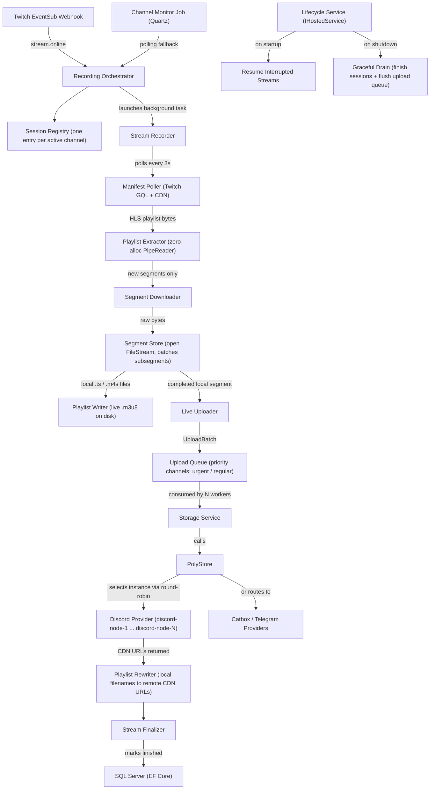
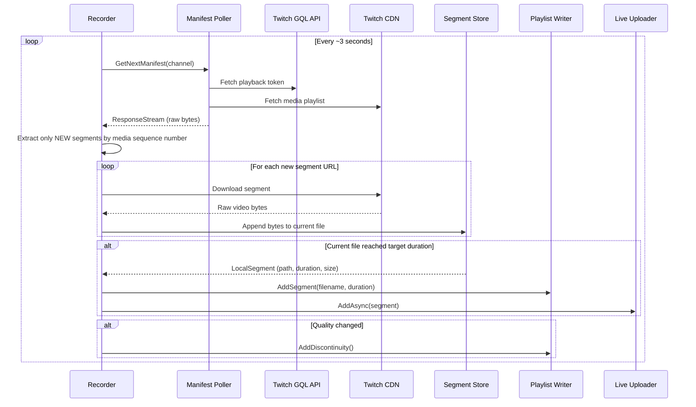
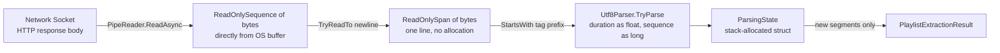
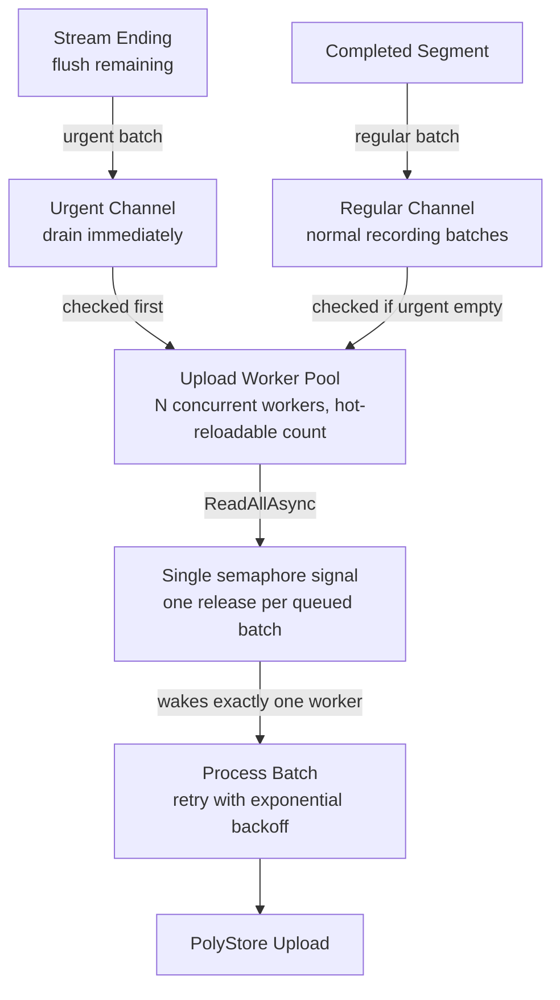
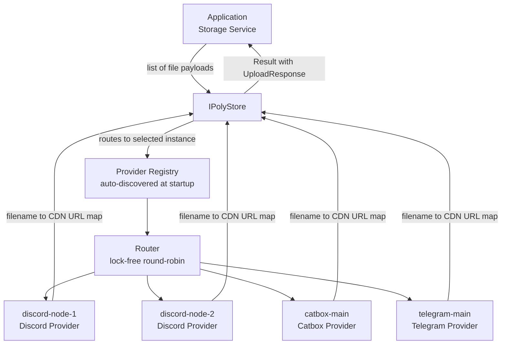
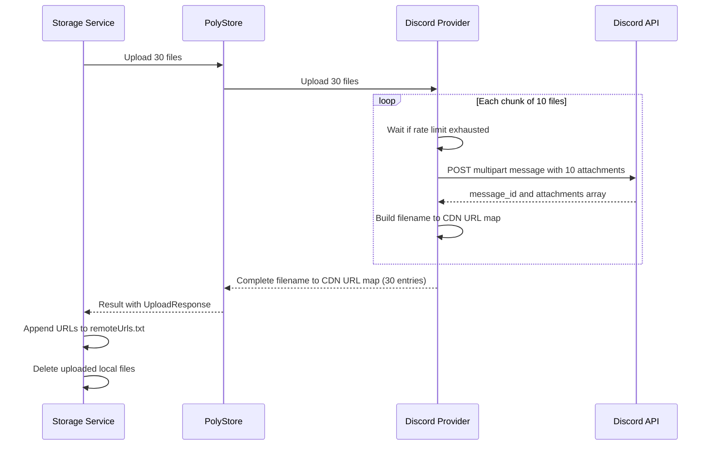
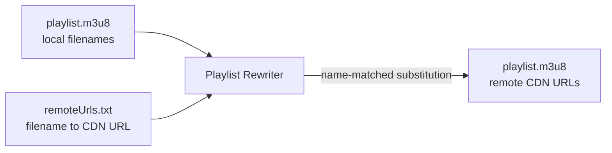
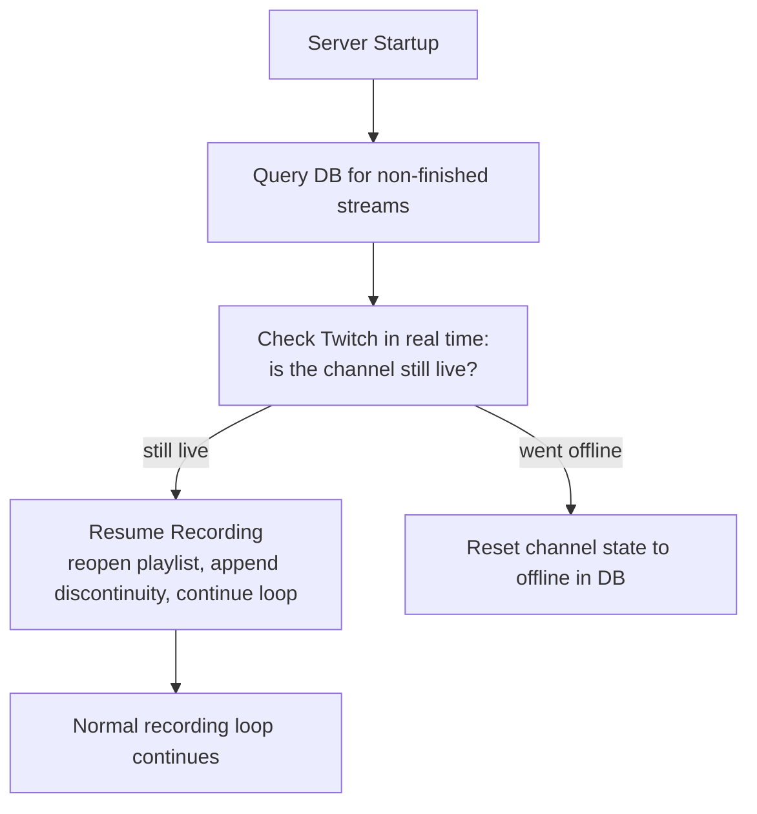

# TwitchVault

> A self-hosted .NET 8 backend that silently records live Twitch streams and archives them to cloud storage — because VODs disappear, get paywalled, or simply never existed.

---

## The Problem

Twitch is an ephemeral platform. Streams end and the recording either vanishes within 14–60 days, never existed as a VOD (ad-free or partner-only content), or requires a subscription to watch. If you want a reliable archive of streams you care about, you are on your own.

TwitchVault solves this by running entirely in the background: it watches for channels to go live via Twitch's webhook system, starts recording the moment a stream begins, uploads segments to cloud storage as they are produced, and has the full archive ready the instant the stream ends — no post-processing step, no waiting.

---

## What It Does

- **Automatic detection** — Twitch pushes a webhook when a monitored channel goes live. No polling required.
- **Real-time HLS recording** — The live stream's media playlist is tracked and each video segment is downloaded and stitched into a local archive as it becomes available.
- **Live upload while recording** — Segments are uploaded to cloud storage concurrently with recording. By the time the stream ends, the archive is already in the cloud.
- **Quality switching mid-recording** — The quality level can be changed at any time while a stream is active. The playlist handles the transition transparently with an HLS discontinuity marker.
- **Crash and restart recovery** — If the server restarts mid-stream, it detects which streams were interrupted, checks if they are still live on Twitch, and seamlessly resumes recording and uploading from where it left off.
- **Automatic VOD cleanup** — Streams that are freely accessible on Twitch (public VOD still available) are automatically pruned after a configurable retention window, since the point is only to preserve what would otherwise be lost.
- **Structured log viewer** — Serilog writes logs to both a rolling file and an embedded SQLite database, queryable through a built-in web UI at `/logs`.
- **Multi-provider cloud storage** — Backed by a purpose-built storage abstraction library (**PolyStore**) that routes uploads across Discord, Telegram, and Catbox through a unified interface.

---

## Architecture Overview

TwitchVault is a single ASP.NET Core application structured around **vertical feature slices** rather than horizontal layers. The bulk of the system is not an HTTP API — it is a set of long-running background pipelines that operate autonomously. The small HTTP API surface exists to manage configuration, trigger manual actions, and surface status.



---

## Feature Slices

```
TwitchVault.Api/
├── Features/
│   ├── Auth/          # Google OAuth → JWT issuance, token validation
│   ├── Channels/      # Channel management, ban lists, Twitch subscriptions
│   ├── Recording/     # HLS pipeline, live upload, session lifecycle
│   ├── Settings/      # Runtime-configurable settings via hot-reload
│   ├── Storage/       # Quartz background jobs: upload, cleanup, VOD pruning
│   ├── Streams/       # Stream entity, queries, HTTP endpoints
│   └── Twitch/        # Twitch GQL client, Helix client, EventSub webhook handling
├── Common/            # File system abstraction, resilience extensions, result types
├── Database/          # EF Core DbContext, entity configs, migrations
├── Configuration/     # Dependency injection wiring, options models
└── Infrastructure/    # Global exception middleware, Swagger, event bus
```

---

## The HLS Recording Pipeline

HLS (HTTP Live Streaming) is Twitch's delivery format. A live stream is broken into short video segments (typically 2–10 seconds each), and a text playlist file — updated every few seconds — lists which segments are available and in what order.

Recording it is not as simple as downloading the playlist. The challenge is doing so continuously, efficiently, and without losing segments or producing gaps.

### How the recording loop works



### Zero-allocation playlist parsing

Every 3 seconds, a new playlist arrives over the wire. Parsing it naively — turning the response into a string, splitting on newlines, allocating arrays — generates continuous garbage that the runtime has to collect. At scale across many concurrent streams, this becomes a measurable throughput issue.

The playlist is parsed using `System.IO.Pipelines`, reading directly from the network buffer without ever materializing a string. The parser works on raw byte spans: it identifies the media sequence number to know where the last poll left off, extracts only the segment URLs and durations that are new, and detects the end-of-stream marker (`#EXT-X-ENDLIST`) — all without a single heap allocation for the parsing itself.



The parsing state is a struct kept on the stack. The entire pass from arriving bytes to a list of new segment URLs allocates only for the final output list itself.

### Segment accumulation — keeping files open

Rather than writing each subsegment as a separate file, the store accumulates incoming data into a single open file stream until the target duration threshold is met (configurable, default 10 seconds). Only then does it close the file, return it as a complete local segment, and hand it off to the playlist writer and the upload queue.

This keeps the number of files manageable and matches the granularity that makes sense for batched cloud uploads.

### Writing the playlist

As each completed segment is handed off, its filename and duration are appended to a live `.m3u8` playlist file on disk. The writer keeps the file stream open for the lifetime of the recording, uses a pre-allocated byte buffer to avoid encoding overhead on every write, and only flushes to disk on a time interval rather than on every segment — making the write path asynchronous and OS-friendly.

When the recorder disposes, it writes the header (with updated total duration and target duration values) and the `#EXT-X-ENDLIST` marker atomically at the end.

---

## Live Upload While Recording

The moment a segment is finalized on disk, it is handed to the upload pipeline. This is not a post-processing step — uploading happens concurrently with recording, so that when the stream ends, the entire archive is already in the cloud.

### The priority queue



The queue uses two `System.Threading.Channels` — one for regular batches, one for urgent ones (the final flush when a stream ends). Workers drain urgent batches first. Rather than awaiting both channels simultaneously — which would leak uncompleted waiter tasks into the channel's internal linked list — the queue uses a single semaphore as a shared signal: any write to either channel releases the semaphore, waking exactly one worker to try-read in priority order.

The number of upload workers is hot-reloadable: changing the count in configuration takes effect immediately without a restart, scaling the pool up or down via cancellation.

### After upload

Once a batch is successfully uploaded, the local segment files are deleted. A `remoteUrls.txt` file in each stream's folder maps every uploaded filename to its CDN URL. This file is the source of truth for playlist rewriting and stream deletion.

---

## PolyStore — The Cloud Storage Library

Discord, Telegram, and Catbox are not storage services. They are messaging APIs, and using them as storage requires dealing with per-provider quirks: Discord allows at most 10 file attachments per message, Telegram has file size limits, Catbox uses a multipart HTTP form upload. None of these details should leak into the recording pipeline.

PolyStore is a purpose-built storage abstraction library (shipped as a referenced assembly) that wraps all of this behind a single, provider-agnostic interface.

### The abstraction



The application hands PolyStore a list of files. It gets back a mapping of filename to remote URL. Everything in between — which provider, how many API calls, what batch size, what rate limits — is invisible to the caller.

### Provider discovery

Providers register themselves with a `[StorageProvider]` attribute. At startup, PolyStore scans the assembly, finds all classes carrying this attribute, and builds a registry. Provider instances are created dynamically from configuration: each entry in `secrets.json` under `Storage.Instances` becomes a live provider instance with its own credentials, concurrency limits, and behavior options — with no code changes required to add a new instance.

```json
{
  "Storage": {
    "Instances": [
      {
        "Name": "discord-node-1",
        "Provider": "Discord",
        "Enabled": true,
        "Behavior": { "MaxBatchSize": 10, "MaxConcurrentUploads": 4 },
        "Properties": { "ChannelId": "...", "BotToken": "...", "CDNHost": "..." }
      },
      {
        "Name": "discord-node-2",
        "Provider": "Discord",
        "Enabled": true,
        "Behavior": { "MaxBatchSize": 10, "MaxConcurrentUploads": 4 },
        "Properties": { "ChannelId": "...", "BotToken": "...", "CDNHost": "..." }
      }
    ]
  }
}
```

Adding another Discord channel as a storage node is a configuration-only change.

### The router

Instance selection uses lock-free round-robin: an atomic integer is incremented on every upload request, and the result modulo the number of enabled instances determines which one handles it. No locks, no contention.

### Discord — the main storage infrastructure

Discord is used as the primary archive backend, primarily because it is free, has no storage quota, and CDN links are stable. But it is not designed to be a file store, which made building a reliable provider genuinely hard.

**The batching problem.** Discord's API allows at most 10 file attachments per message. A single upload call from the application may contain any number of files, so the provider internally chunks them into groups of 10, sends one API request per chunk, and accumulates the results. The caller is unaware of this.

**Rate limiting.** Discord's rate limit information is embedded in response headers (`X-RateLimit-Remaining`, `X-RateLimit-Reset-After`). The provider reads these on every response and waits before sending the next request when the remaining count reaches zero. This is a per-instance concern — multiple instances each manage their own limits independently.

**CDN URL construction.** Discord attachments don't return a direct CDN URL; the URL is assembled from the message ID and attachment ID in the API response. The provider constructs this internally and returns it as part of the filename-to-URL map.

**Idempotent deletion.** When a stream is deleted, all its remote files need to be removed. The provider reads the `remoteUrls.txt` file, extracts Discord message IDs from the URLs, and issues a bulk delete request. If a message is already gone (404), that is silently ignored — deletion is safe to retry.



### Playlist rewriting after upload

The final step before a stream is marked as fully uploaded is rewriting the playlist. Every segment filename in the `.m3u8` file needs to be replaced with its corresponding remote CDN URL, so that the playlist can be served directly to a media player without any local files present.

This is done by name-matching: the rewriter reads the playlist line by line, and for each line that looks like a segment filename, it looks that filename up in the `remoteUrls.txt` map and substitutes the CDN URL. Because matching is by name and not by line position, this is fully idempotent — it can be run multiple times safely, and partial uploads are handled correctly.



---

## Crash Recovery & Graceful Shutdown

### Resuming after a restart

On every startup, TwitchVault queries the database for any streams that were in a non-finished state when the server last stopped. For each one, it checks Twitch in real time to see if that stream is still live. If it is, recording resumes immediately — the playlist writer reopens the existing `.m3u8` file, reads the last known state (segment count, total duration, whether the last entry was a discontinuity), appends a discontinuity marker to signal the gap, and continues appending from where it left off.



A 10–15 second server restart results in a barely perceptible gap in the recording, marked cleanly by an HLS discontinuity rather than corruption.

### Graceful shutdown

When the server receives a shutdown signal, all active recording sessions are signalled to stop concurrently via cancellation. The upload queue drains its in-flight workers with a configured timeout before the process exits, ensuring that any segments that were mid-upload are not silently lost.

---

## Challenges & Solutions

### Keeping segment downloads off the heap

Every video segment Twitch delivers is between 1.5 MB and 2.5 MB. The naive implementation reads the HTTP response body into a buffer in memory and then copies it to disk. The problem is that objects larger than ~85 KB go directly onto the .NET Large Object Heap, where they can only be reclaimed by a full (Gen 2) garbage collection. At sustained throughput across many concurrent streams, this means the runtime spends measurable time in stop-the-world GC pauses.

The solution is to never buffer the response at all. The HTTP response body stream is passed directly into the file write path, so bytes flow from the network socket to disk without an intermediate in-memory copy.

---

### Parsing playlists without allocating

The manifest poller fetches a new playlist every 3 seconds per stream. The original approach decoded the response to a string and split on newlines, allocating a fresh string array on every poll. Across many concurrent streams this produces a constant stream of short-lived heap garbage.

The replacement uses `System.IO.Pipelines` to consume the response as a sequence of raw byte buffers directly from the network. The parser never produces a string — it works on byte spans, using `Utf8Parser` to decode numbers directly from UTF-8 bytes, and a stack-allocated state struct to track progress through the playlist. The only allocations are for the final list of new segments, which is the unavoidable output.

---

### Making the upload queue wake up correctly

The upload queue uses two independent channels internally — one for regular batches, one for urgent ones triggered when a stream ends and needs to flush immediately. The natural approach is to await both channels simultaneously and wake on whichever one produces data first.

The problem: when the regular channel wins, the pending wait on the urgent channel is abandoned. In .NET's channel implementation, calling `WaitToReadAsync` registers a waiter node inside the channel's internal linked list. Abandoning that call without awaiting it means the node is never removed. Over time, across thousands of polling cycles, these orphaned nodes accumulate — a memory leak that grows with uptime.

The solution replaces the dual-wait with a single semaphore as a shared signal. Any write to either channel releases the semaphore exactly once (using an atomic exchange to prevent double-release). Workers wait on the semaphore, then try to read from the urgent channel first, falling back to the regular channel. One signal, no abandoned waiters, correct priority ordering.

---

### Segment size that grew quadratically

Stream size is tracked to report how much data a stream produced. The implementation appended each subsegment's contribution to a running total by reading the current file size after each write. The mistake: reading the file size returns the total file length, not the bytes just written in the current operation. After N writes of size S to the same file, the accumulated total was `S + 2S + 3S + ... + NS = N(N+1)S/2` — quadratic growth. A 1-hour stream was being reported as many times larger than it actually was.

The fix reads the file size exactly once when the file is closed, assigning that final value directly rather than summing incremental contributions.

---

### Deduplicating recording sessions

Twitch delivers live notifications via webhooks, but the system also runs a polling fallback job for reliability. When a channel goes live, both can fire nearly simultaneously — and both would try to start a recording session for the same channel.

The guard is a concurrent dictionary keyed by channel ID. A session is only allowed to start if it can atomically insert its entry into that dictionary. Using `TryAdd` (which is atomic) rather than a read-then-write pair (which is not) eliminates the race window where two concurrent callers both see the key as absent and both proceed.

---

### Stopping recordings in parallel at shutdown

When the server shuts down with many active recording sessions, the original implementation stopped them sequentially — waiting for each session to fully finalize before moving to the next. With many concurrent streams, this meant shutdown could take several minutes.

The fix cancels all sessions simultaneously and then awaits all of their background tasks in parallel. Shutdown time collapses to roughly the duration of the single longest-running finalization.

---

### Discord's 10-attachment limit hidden behind a clean interface

Discord's messages API accepts at most 10 file attachments per request. A batch upload call from the application may contain 20, 30, or more files. Exposing this limit to the caller would mean every upload site had to know about Discord's internal constraints — a clear abstraction violation.

The Discord provider handles chunking internally. It receives any number of files, splits them into groups of 10, fires one API request per group, merges the results, and returns a single unified filename-to-URL map to the caller. From the outside, a 30-file upload is indistinguishable from a 3-file upload.

---

## Tech Stack

| Layer | Technology |
|---|---|
| Runtime | .NET 8, ASP.NET Core (Minimal APIs) |
| Database | SQL Server via EF Core 8 (pooled `DbContextFactory`) |
| Background jobs | Quartz.NET hosted service |
| HTTP resilience | Polly (`Microsoft.Extensions.Http.Resilience`) — retry with exponential backoff + jitter |
| Logging | Serilog — Console, rolling file, async SQLite sink with Serilog UI |
| Cloud storage | PolyStore (custom library) — Discord, Telegram, Catbox |
| Twitch integration | TwitchLib.EventSub.Webhooks (webhook delivery), custom Twitch GQL client |
| Auth | Google OAuth to JWT (HS256), sliding-window rate limiter on auth endpoints |
| Testing | xUnit, covering HLS pipeline, storage jobs, channel and stream logic |

---

## Configuration

Key settings in `appsettings.json`:

```json
{
  "Vault": {
    "MaxSegmentDurationInSec": 10,
    "MaxConsecutiveEmptyPolls": 3,
    "UploadBatchSize": 10,
    "MaxConcurrentUploadWorkers": 20,
    "IdleFlushTimeoutSeconds": 8,
    "PublicVodRetentionDays": 7
  },
  "BackgroundJobs": {
    "ChannelMonitor":   { "Enabled": true, "RunIntervalInMinutes": 1 },
    "StorageUpload":    { "Enabled": true, "RunIntervalInMinutes": 2 },
    "StorageCleanup":   { "Enabled": true, "RunIntervalInMinutes": 5 },
    "PublicVodCleanup": { "Enabled": true, "CronExpression": "0 0 3 * * ?" }
  }
}
```

Provider credentials and storage instances are declared in `secrets.json` (excluded from source control) under the `Storage.Instances` array, as shown in the PolyStore section above.

---

## Project Layout

```
TwitchVault/
├── src/
│   └── TwitchVault.Api/
│       ├── Features/          # Vertical feature slices
│       ├── Common/            # Shared abstractions and utilities
│       ├── Database/          # EF Core context and migrations
│       ├── Configuration/     # DI wiring and options
│       ├── Infrastructure/    # Middleware, Swagger
│       └── lib/               # PolyStore assemblies
├── test/
│   └── TwitchVault.Api.Tests.Unit/
└── misc/                      # Architecture docs and audit reports
```
